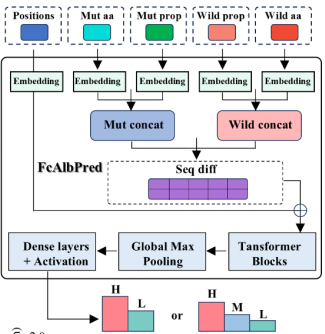

# FcAlbPred: HSA-FcRn Binding Affinity Prediction


**FcAlbPred** is a deep learning-based tool designed to predict the impact of Human Serum Albumin (HSA) mutations on its binding affinity with the Neonatal Fc Receptor (FcRn).The model employs hybrid feature inputs (sequence information + physicochemical properties) and a Transformer/BiLSTM architecture. It can efficiently and accurately perform binary classification (enhanced/reduced binding) or multi-class prediction on binding affinity after mutations.


## Features

*   **Multi-modal Input Features**:
    *   **Sequence Features**: Integer encoding of amino acid sequences before and after mutation.
    *   **Physicochemical Properties**: Integrates hydrophobicity, polarity, charge, acidity/basicity, and molecular weight, with standardization applied.
*   **Model Architecture**:
    *   Utilizes **Embedding** layers to extract sequence semantics.
    *   Incorporates **Transformer (MultiHeadAttention)** or **BiLSTM** mechanisms to capture long-range dependencies.
    *   Explicitly models mutation-induced changes via a difference vector (`diff = emb_aft - emb_pre + emb_pos`).
*   **Ensemble Strategy**: Combines prediction results from binary and multi-class models during inference using weighted fusion.
*   **Complete Workflow**: Includes a full suite of code from model training to final inference and evaluation.

## Installation

This project depends on Python 3.9 and TensorFlow. It is recommended to use Conda for environment configuration.

### 1. Clone the repository
```bash
git clone https://github.com/mingkangyang/FcAlbPred.git
cd FcAlbPred
```
### 2. Create environment
```bash
conda env create -f environment.yml
conda activate FcAlbPred
```

## Usage

### 1.Data Processing
Extract sequence information and map mutations.
```python
python src/data_extract.py
```
Input: data/HSA_mutation_input_3w.csv, data/4N0F.pdb

Output: data/HSAonly_dict_3w.pkl
### 2.Model Training
Read the processed .pkl data, construct the dataset, and start model training. The code will automatically save the model weights with the highest accuracy on the validation set.
```python
python src/train.py
```
### 3.Model Inference
Perform inference using the trained binary and multi-class models. Supports joint inference strategy.
```
python src/infer.py
```

## License & Citation
This project is licensed under the MIT License. If you use this project in your research, please cite the relevant work.